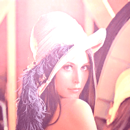
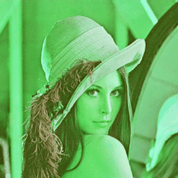
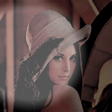
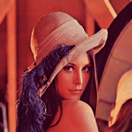
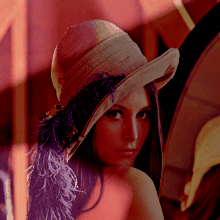
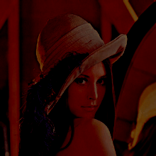
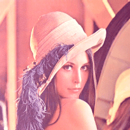
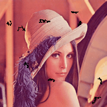
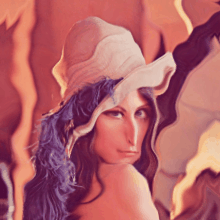
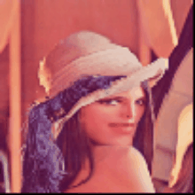

# AUG-alpha

AUG is an open source augmentation library based on OpenCV. The repository contains a set of image transformations for data augmentation and artificial data synthesis.

##### Major features:

* supports operations on masks and points,
* unified interface - most magnitude coefficients are in the range [0, 1],
* optimized operations,
* reusable blocks of operations, e.g. transfer learning based on augmentation parameters (AutoAugment)
* unique operations compared to imgaug/albumentations,
* Python 3, OpenCV 4.1.


## Installation

##### Pip:
```
pip install aug
```

##### The latest version, directly from github:
```
pip install -U git+https://github.com/cta-ai/aug
```

## Example operations
|   |   |   |   |
|---|---|---|---|
| Jitter | Radial gradient | Channel Shuffle |  Cutout  |
|||||
| Blend with random images | CLAHE | Contrast | Zoom |
|||||
| Salt and pepper | Dilation | Erosion | Texture modification |
|||||
| Flashlight | Flips | Gamma | Random shadow |
|||| |
| Gaussian noise | Brightness | Inversion | Rotation90 |
|||||
| Gaussian blur | Motion blur | Variable blur | Pixelize |
|||||
| Median blur | Linear gradient | JPEG noise | Random Curve|
|||||
| Elastic transformation | Optical transformation | Perspective transformation | Grid distortion  |
|||||
| Rotation | Scratches | Halo effect | |
||||   |


## Example usage:
```
import aug

class SimpleExample(aug.Pipeline):
    def __init__(self):
        super(SimpleExample, self).__init__()
        self.seq = aug.Sequential(
            aug.Rotation(p=.5, angle=90),
            aug.GaussianBlur(p=1.),
        )

    def apply(self, sample):
        return self.seq.apply(sample)
        

sample = SimpleExample().apply(aug.Sample(image, annotations, masks))


```

More: [Getting started](GETTING_STARTED.md).

## Releases

v0.1.0 - 16/07/2019
 - Initial alpha release.


## Licence
[Apache License 2.0](LICENSE)


## Contact

Project is maintained mainly by Tomasz Gilewicz ([@tgilewicz](https://github.com/tgilewicz)).
